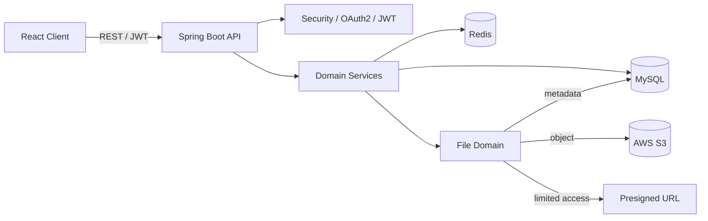
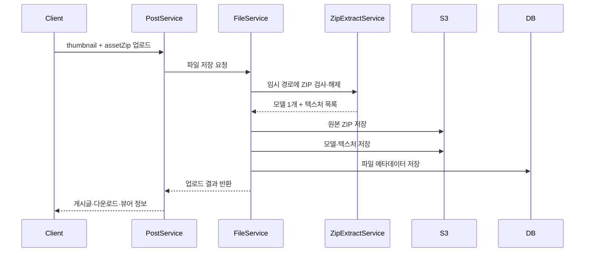
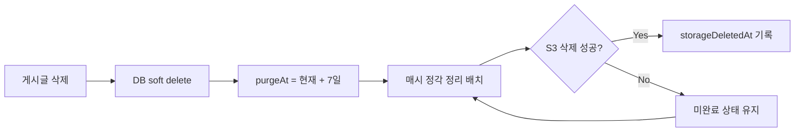

# AssetBox

> **3D 에셋을 안전하게 공유하고 재사용하기 위한 사내 협업 플랫폼**  
> 백엔드 개발자 한승우의 파일 도메인 설계·구현 경험을 중심으로 정리한 개인 프로젝트 README입니다.

배포 주소: [https://assetbox.cloud/](https://assetbox.cloud/)

## 프로젝트를 한 문장으로 설명하면

AssetBox는 아티스트와 개발자가 FBX·GLB 모델, 텍스처, 썸네일을 게시글 단위로 등록하고 미리보기·검색·다운로드할 수 있는 3D 에셋 공유 서비스입니다.

단순 파일 보관함이 아니라, 에셋 게시글과 요청 게시판, 댓글, 태그, 1:1 메시지를 연결해 **필요한 에셋을 요청하고 결과물을 팀 자산으로 축적하는 흐름**을 만드는 것이 목표였습니다.

## 프로젝트 정보

| 구분 | 내용 |
| --- | --- |
| 개발 형태 | 8인 팀 프로젝트 |
| 담당 | 백엔드 파일 도메인 |
| 아키텍처 | 도메인형 모듈러 모놀리스 |
| 주요 도메인 | User, File, Post, Request, Comment, Category, Tag, Message, Feedback |
| 핵심 저장소 | MySQL(메타데이터), AWS S3(파일), Redis(토큰·메시징) |

## 왜 이 프로젝트를 만들었나

3D 에셋은 모델 하나만으로 끝나지 않습니다. 모델 파일과 여러 텍스처가 디렉터리 구조를 이룰 수 있고, 원본은 다운로드해야 하지만 웹 미리보기에는 해제된 모델과 텍스처가 필요합니다. 파일 크기가 크기 때문에 잘못된 업로드나 즉시 삭제 정책은 저장 비용과 복구 가능성에도 영향을 줍니다.

따라서 다음 문제를 백엔드에서 해결했습니다.

- ZIP 하나를 업로드하면 원본 ZIP과 뷰어용 모델·텍스처를 구분해 저장
- 허용하지 않은 확장자, 경로 조작, 과도한 압축 해제 용량을 업로드 단계에서 차단
- 일부 파일만 S3에 남는 실패 상황을 보상 처리
- 비공개 S3 객체를 Presigned URL로 제한적으로 제공
- 삭제 즉시 복구 불가능해지는 문제를 7일 유예 후 물리 삭제하는 방식으로 완화

## 전체 기능

- 일반 로그인 및 Google·Naver OAuth2 로그인, JWT 인증
- 에셋 게시글 CRUD, 카테고리·태그 검색, 좋아요와 댓글
- 요청 게시글 등록 및 에셋 게시글 연결 시 요청 상태 자동 완료
- 1:1 메시지와 읽지 않은 메시지 수 조회
- 관리자용 사용자·게시글·피드백 관리
- S3 기반 썸네일·참고 이미지·3D 에셋 업로드 및 다운로드
- Docker Compose와 GitHub Actions 기반 테스트·배포 구성

## 기술 스택

| 영역 | 기술 |
| --- | --- |
| Language | Java 25 |
| Framework | Spring Boot 4.0.6, Spring MVC, Spring Data JPA |
| Security | Spring Security, OAuth2 Client, JWT |
| Database | MySQL, Flyway, H2(Test) |
| Storage / Cache | AWS S3, Redis, Redisson |
| API | REST, Swagger/OpenAPI |
| Test | JUnit 5, Mockito, Spring Boot Test |
| Infra | Docker, Docker Compose, GitHub Actions, GHCR, Nginx Proxy Manager |

## 시스템 구조



도메인별로 `controller → service → repository → domain` 책임을 나누고, 다른 도메인의 저장소를 직접 사용하는 대신 서비스 경계를 통해 협업하도록 구성했습니다. 파일 도메인은 Post·Request 등에서 호출하는 공통 저장 계층이며, 연결 대상은 `purpose + purposeId`로 표현합니다.

## 나의 역할과 기여

Git 커밋 이력과 현재 코드에서 확인되는 기여를 기준으로 작성했습니다.

### 1. 파일 도메인 설계와 S3 연동

- 파일의 연결 대상을 `FilePurpose`로 구분하고 메타데이터는 DB, 바이너리는 S3에 저장했습니다.
- S3 Key 생성 규칙을 별도 컴포넌트로 분리해 객체 경로 생성을 일관되게 관리했습니다.
- 이미지 조회와 원본 다운로드에 각각 Presigned URL을 발급해 S3 버킷 공개 없이 접근하도록 구현했습니다.
- 다중 업로드·삭제와 업로드 순서 보존을 지원하고 단위 테스트를 작성했습니다.

### 2. 3D 에셋 ZIP 업로드 파이프라인

사용자는 원본 ZIP 하나만 업로드하지만, 서버는 다운로드용 원본과 웹 뷰어용 파일을 함께 준비합니다.



핵심 방어 로직은 다음과 같습니다.

- ZIP 내부 경로를 정규화하고 추출 디렉터리 밖으로 벗어나는 Zip Slip 차단
- 중복 경로와 비허용 확장자 차단
- 압축 해제 파일 수, 개별 파일 크기, 전체 크기 상한 적용
- 모델 파일이 없거나 두 개 이상인 경우 실패 처리
- 원본 상대 경로를 보존해 텍스처 디렉터리 구조 유지
- 작업 종료 후 임시 파일 정리

### 3. DB 트랜잭션과 S3 사이의 불일치 대응

DB 트랜잭션은 롤백할 수 있지만 이미 업로드한 S3 객체는 자동으로 사라지지 않습니다. 이를 그대로 두면 실패한 요청이 고아 객체와 저장 비용을 남깁니다.

업로드 중 예외가 발생하면 그 요청에서 저장한 S3 Key를 추적해 삭제하고, 게시글 썸네일 저장 후 에셋 업로드가 실패한 경우에도 썸네일을 보상 삭제하도록 구성했습니다. 즉, 서로 다른 저장 시스템을 하나의 ACID 트랜잭션처럼 오해하지 않고 **실패 시 정합성을 회복하는 보상 처리**를 적용했습니다.

### 4. 7일 지연 삭제와 재시도 가능한 정리 배치

사용자 삭제 요청에는 DB 행과 S3 객체를 즉시 제거하지 않고 soft delete와 `purgeAt`을 기록합니다. 매시 정각 스케줄러가 보존 기간이 지난 객체를 삭제하며, S3 삭제 성공 후에만 완료 시각을 기록합니다.



이 설계로 실수로 삭제한 데이터의 복구 여지를 남기고, 일시적인 S3 장애가 발생해도 다음 배치에서 다시 시도할 수 있게 했습니다. 실제 물리 삭제 시점은 정확히 7일 후가 아니라 `purgeAt` 이후 첫 정각 배치입니다.

### 5. 테스트와 API 계약 문서화

- 파일 확장자·크기·빈 파일 검증 단위 테스트
- S3 Key 생성과 저장·삭제 예외 테스트
- ZIP 정상/비정상 구조와 용량 제한 테스트
- 게시글 생성부터 ZIP 다운로드, 뷰어 조회, 지연 삭제까지 이어지는 통합 테스트
- 프론트엔드가 `downloadFile`과 `viewer`를 구분해 사용할 수 있도록 에셋 게시글–파일 API 계약 문서 작성

## 대표 기술적 의사결정

### 왜 ZIP 원본과 해제 파일을 모두 저장했나?

다운로드 사용자는 제작자가 구성한 원본 묶음을 받아야 하지만, 웹 뷰어는 ZIP을 직접 렌더링할 수 없습니다. 원본 ZIP은 다운로드 대상으로, 해제한 모델·텍스처는 미리보기 대상으로 분리해 각 사용 목적을 만족시켰습니다. 대신 저장 공간이 늘어나는 비용이 있어 업로드 용량 제한과 지연 삭제 정책을 함께 적용했습니다.

### 왜 서버를 거쳐 파일을 내려주지 않고 Presigned URL을 사용했나?

대용량 파일을 애플리케이션 서버가 중계하면 서버의 네트워크와 메모리 사용량이 커집니다. 짧은 시간만 유효한 URL로 S3가 직접 전송하게 해 애플리케이션의 부하를 줄이고, 버킷을 공개하지 않은 채 접근을 통제했습니다.

### 왜 물리 삭제를 별도 스케줄러로 분리했나?

사용자 요청 트랜잭션 안에서 S3 삭제까지 수행하면 외부 저장소 장애가 API 응답과 DB 처리에 직접 영향을 줍니다. 먼저 삭제 상태와 예정 시각을 DB에 확정한 뒤 별도 배치가 S3를 정리하도록 분리해 실패를 재시도 가능한 상태로 만들었습니다.

## 트러블슈팅

### ZIP 업로드가 부분 성공해 S3에 파일이 남는 문제

- **문제**: 여러 객체 중 하나의 업로드나 DB 저장이 실패하면 앞서 업로드된 객체가 남을 수 있었습니다.
- **원인**: 관계형 DB 트랜잭션이 외부 S3 작업까지 롤백해 주지 않기 때문입니다.
- **해결**: 요청 단위로 업로드된 Key를 수집하고 예외 발생 시 역순으로 보상 삭제했습니다.
- **배운 점**: 외부 시스템이 포함된 흐름에서는 성공 경로뿐 아니라 실패 단계별 정리 전략이 도메인 로직의 일부입니다.

### ZIP 내부의 위험하거나 과도한 파일 문제

- **문제**: 파일 확장자만 확인하면 경로 조작이나 압축 해제 폭증을 막을 수 없었습니다.
- **해결**: 정규화된 대상 경로가 추출 루트 내부인지 확인하고, 스트림을 읽는 동안 개별·누적 크기를 측정했습니다. 파일 개수와 중복 경로도 제한했습니다.
- **배운 점**: 업로드 검증은 요청 파일의 겉보기 정보가 아니라 실제 처리 과정에서 계속 수행해야 합니다.

### 삭제 실패를 성공으로 기록할 수 있는 문제

- **문제**: S3 삭제 전에 완료 상태를 기록하면 외부 호출 실패 시 DB와 저장소가 불일치합니다.
- **해결**: S3 삭제 성공 뒤에만 완료 시각을 기록하고, 실패한 대상은 조회 조건에 남겨 다음 배치가 재시도하게 했습니다.
- **배운 점**: 배치 작업은 여러 번 실행해도 완료 상태가 망가지지 않는 재실행 가능성이 중요합니다.

## 프로젝트를 통해 보여주고 싶은 역량

- 파일 업로드를 단순 CRUD가 아닌 **보안·정합성·비용·복구 정책이 결합된 흐름**으로 설계한 경험
- DB와 외부 저장소의 트랜잭션 경계 차이를 이해하고 보상 처리와 재시도 구조를 적용한 경험
- 정상 동작뿐 아니라 악성 ZIP, 부분 실패, 외부 저장소 장애 같은 예외 경로를 테스트한 경험
- Post·Request 도메인과 합의할 API 계약을 문서화하고 통합 테스트로 연결한 협업 경험
- 구현의 편의보다 사용자의 다운로드 경험과 운영자의 복구 가능성을 함께 고려한 의사결정 경험

## 아쉬운 점과 개선 방향

- 정리 배치가 한 번에 모든 만료 대상을 조회하므로, 데이터가 커지면 페이지 처리와 분산 락이 필요합니다.
- 보상 삭제가 최종적으로 계속 실패하는 경우를 추적할 DLQ나 운영 알림이 없어 별도 실패 테이블과 모니터링을 추가할 수 있습니다.
- Presigned URL 발급 API에서 파일 소유권과 다운로드 권한 정책을 더 세분화하고 발급 이력을 감사 로그로 남길 수 있습니다.
- MIME type을 클라이언트 제공 값에 의존하지 않고 파일 시그니처 검사로 보강할 수 있습니다.
- 단위·통합 테스트에 더해 실제 S3 호환 환경(LocalStack/Testcontainers)을 사용하는 E2E 테스트를 추가할 수 있습니다.

## 실행 방법

### 사전 요구사항

- JDK 25
- Docker / Docker Compose
- AWS S3 버킷 및 OAuth2 애플리케이션 설정

환경 변수 예시는 [`.env.production.example`](./.env.production.example), 배포 절차는 [`DEPLOY.md`](./DEPLOY.md)를 참고합니다. 실제 자격 증명은 저장소에 커밋하지 않습니다.

```bash
# 테스트
./gradlew test

# 로컬 애플리케이션 실행
./gradlew bootRun

# 전체 컨테이너 실행
docker compose up -d
```

애플리케이션 실행 후 Swagger UI는 `/v3/swagger-ui`에서 확인할 수 있습니다.

